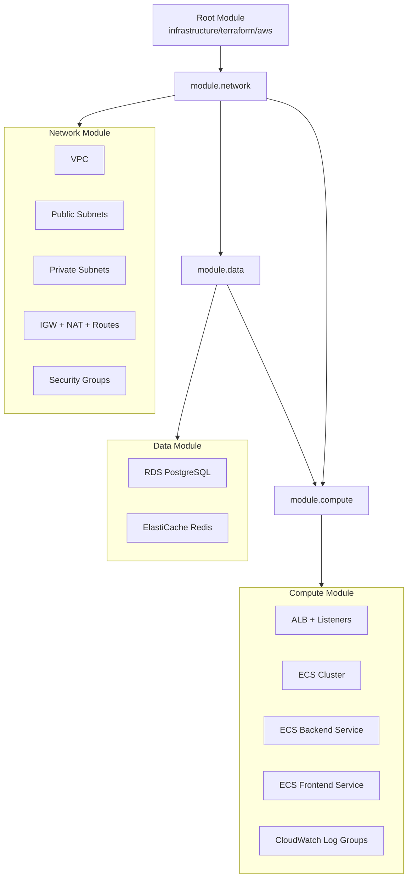

# Terraform AWS Provisioning Guide (Folio)

## Overview
This repository provisions Folio infrastructure on AWS using Terraform in [infrastructure/terraform/aws](infrastructure/terraform/aws).

The Terraform stack creates:
- VPC with public/private subnets across multiple AZs
- Internet Gateway, NAT Gateway, route tables
- Security groups for ALB, ECS services, RDS, and Redis
- Application Load Balancer (HTTP)
- ECS Cluster (Fargate) with two services:
  - frontend service
  - backend service
- Amazon RDS PostgreSQL instance
- ElastiCache Redis cluster
- CloudWatch log groups for ECS services

Request routing at ALB:
- `/api*`, `/actuator*` -> backend target group
- all other paths -> frontend target group

## Folder and Files
Terraform root:
- [infrastructure/terraform/aws](infrastructure/terraform/aws)

Key files:
- [infrastructure/terraform/aws/versions.tf](infrastructure/terraform/aws/versions.tf): Terraform and provider constraints
- [infrastructure/terraform/aws/variables.tf](infrastructure/terraform/aws/variables.tf): deployment inputs
- [infrastructure/terraform/aws/modules.tf](infrastructure/terraform/aws/modules.tf): wires child modules together
- [infrastructure/terraform/aws/modules/network/main.tf](infrastructure/terraform/aws/modules/network/main.tf): VPC/subnets/NAT/routes/security groups
- [infrastructure/terraform/aws/modules/data/main.tf](infrastructure/terraform/aws/modules/data/main.tf): PostgreSQL + Redis
- [infrastructure/terraform/aws/modules/compute/main.tf](infrastructure/terraform/aws/modules/compute/main.tf): ALB + ECS cluster/services/tasks + logs
- [infrastructure/terraform/aws/outputs.tf](infrastructure/terraform/aws/outputs.tf): output URLs/endpoints
- [infrastructure/terraform/aws/terraform.tfvars.example](infrastructure/terraform/aws/terraform.tfvars.example): sample config

Why modules are used:
- Reuse: the same module patterns can be reused across environments and projects.
- Readability: root config stays small and focused on composition.
- Ownership: teams can own network/data/compute modules independently.
- Safer change scope: updates are isolated to one module instead of a monolithic root file.

## Prerequisites
- AWS account with permissions for VPC, ECS, ELB, IAM, RDS, ElastiCache, CloudWatch
- Terraform CLI 1.6+
- AWS CLI configured locally (`aws configure`)
- Backend and frontend container images pushed to an accessible registry (typically ECR)

## How Provisioning Works
1. Terraform reads variables from `terraform.tfvars` and merges tags from locals.
2. Root module composes child modules in this dependency order:
   - `module.network`
   - `module.data` (depends on network outputs)
   - `module.compute` (depends on network + data outputs)
3. Network layer is created first (VPC/subnets/routes/security groups).
4. Data layer is provisioned (RDS + Redis) in private subnets.
5. Compute and ingress are provisioned (ALB + ECS Fargate services).
6. ECS task definitions inject runtime environment variables for DB/Redis connectivity.
7. Outputs expose ALB URL and key service endpoints.

## Resource Graph (Module-Level)



## Run Terraform (First Time)
From repo root:

```bash
cd infrastructure/terraform/aws
cp terraform.tfvars.example terraform.tfvars
```

Edit `terraform.tfvars` with your values:
- `backend_image`
- `frontend_image`
- `db_password`
- optional scale and sizing overrides

Then run:

```bash
terraform init
terraform fmt
terraform validate
terraform plan -out=tfplan
terraform apply tfplan
```

After apply, check outputs:

```bash
terraform output
```

Open the app using `frontend_url` output.

## Validate Without Creating Any Resources

Use this flow to validate code quality and graph correctness without provisioning.

### A) Static checks only (no provider calls)

```bash
cd infrastructure/terraform/aws
terraform fmt -recursive -check
terraform validate
```

### B) Full plan simulation without touching remote backend

If backend is configured in code, `terraform plan` can still ask for backend init.
For no-backend dry-run in local testing, use a temporary copy:

```bash
TMP_DIR="/tmp/folio-tf-nobackend-plan"
rm -rf "$TMP_DIR"
mkdir -p "$TMP_DIR"
cp -R infrastructure/terraform/aws/. "$TMP_DIR/"

# Remove backend block only in temp copy
perl -0777 -i -pe 's/\n\s*backend\s+"s3"\s*\{\s*\}//s' "$TMP_DIR/versions.tf"

cd "$TMP_DIR"
terraform init -backend=false -reconfigure
terraform plan -refresh=false -var-file=terraform.tfvars.example
```

Notes:
- This still needs valid AWS credentials because provider planning reads account context.
- No resources are created unless you run `terraform apply`.

## What Happens If State Is Corrupted?

Symptoms:
- unexpected recreate/destroy plans
- `state` command errors
- resources exist in AWS but Terraform cannot reconcile correctly

Recovery sequence (safe order):
1. Stop all applies and ensure only one operator proceeds.
2. Back up current state immediately:

```bash
terraform state pull > state-backup-$(date +%Y%m%d-%H%M%S).json
```

3. If using S3 backend, restore a known-good state object version.
4. Re-run `terraform init -reconfigure`.
5. Run `terraform plan` and inspect drift carefully.
6. Repair mapping with `terraform import` for missing objects.
7. Use `terraform state rm` only when you intentionally want Terraform to stop managing an object.

Last-resort options:
- `terraform apply -refresh-only` to align state metadata first.
- targeted imports for critical resources (ALB, ECS services, RDS, Redis).

## What If You Run Without State But Resources Already Exist?

If Terraform has no state and resources already exist in AWS, Terraform assumes it must create everything.

Typical outcomes:
- plan shows many creates
- apply fails on duplicate names/identifiers
- or creates parallel resources if names are random/available

Safe approach:
1. Do not apply immediately.
2. Recover original state (preferred), or rebuild state through imports.
3. Import existing resources into state before apply:

```bash
terraform import <resource_address> <real_aws_id>
```

Examples of critical imports first:
- ALB
- target groups
- ECS cluster/services
- RDS instance
- ElastiCache cluster

After imports, run `terraform plan` again until it becomes mostly no-op or expected deltas only.

## Update / Rollout Changes
When you publish a new container tag:
1. Update image URI/tag in `terraform.tfvars`
2. Run:

```bash
terraform plan -out=tfplan
terraform apply tfplan
```

Terraform updates ECS task definitions/services and performs a rolling deployment.

## Verify Deployment
- ALB URL returns frontend page
- `/api/health` returns backend health JSON
- ECS services show desired/running task counts
- CloudWatch logs exist for frontend and backend

Useful checks:

```bash
terraform output frontend_url
terraform output backend_health_url
```

## Destroy (Cleanup)
To remove all provisioned resources:

```bash
terraform destroy
```

## Current Constraints and Recommended Enhancements
Current scaffold is intentionally minimal for learning and iteration speed.

Recommended production upgrades:
- HTTPS: ACM certificate + ALB listener on 443
- Secrets: move DB password to AWS Secrets Manager
- State backend hardening: add locking via DynamoDB or migrate to Terraform Cloud if team concurrency grows
- Autoscaling: ECS target tracking policies
- Observability: ADOT collector + X-Ray/CloudWatch integration
- WAF on ALB
- Multi-environment folder/workspace strategy (`dev`, `stage`, `prod`)

## Common Troubleshooting
- `terraform: command not found`
  - Install Terraform and re-run
- Image pull failures in ECS
  - Verify image URI/tag and registry access
- ALB health checks failing
  - Confirm backend container listens on `8080`
  - Confirm frontend container listens on `5173`
- DB connection failures
  - Confirm SG rules and injected datasource env vars
